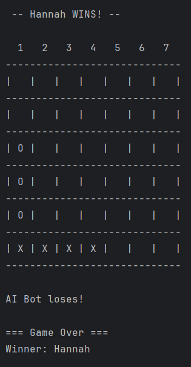

# ConnectFourGame
Connect 4 between 1 person VS robot or Player VS Player. Player can choose opponent difficulty (if using bot) and enter their own name(s).
 ***
## Patterns Used...
* Observer Pattern, the game board will update the observers when the board changes or game ends
* Command, each move is encapsulated as a Command (execute to place, undo to undo that choice)
* State Pattern is how we keep track of the state of the game (setupState, playerTurnState, opponentTurnState, gameOverState). Each state handles its own behavior and transitions.
* Factory Method, a CharacterFactory that creates Player and Opponent instances
* Strategy Pattern, used for win checking strategies (vertical, horizontal, diagonal) and opponent AI behavior (Level 1 - Leftmost, Level 2 - Random, Level 3 - Defensive)
***

## Locations of patterns and their files...

* Observer Pattern based files are in the observers folder (EventBus, IObserver, EventType)
* Command Pattern based files are in the command folder (Command interface, PlacePieceCommand)
* State Pattern based files are in the state folder (State interface, setupState, playerTurnState, opponentTurnState, gameOverState, GameContext)
* Factory Pattern is CharacterFactory inside of characters folder, and there is also a StrategyFactory
* Strategy Pattern based files are in the strategy folder:
    * Win strategies: VerticalWinStrategy, HorizontalWinStrategy, DiagonalWinStrategy
    * Opponent AI strategies: Level1Strategy, Level2Strategy, Level3Strategy, StrategyFactory

***

## Features
- 6x7 Connect Four board (standard size)
- Player can enter custom name
- Three difficulty levels for AI opponent (1 = leftmost move, 2 = random, 3 = defensive)
- Undo functionality for player moves
- Event-driven display updates

***
## Tests
We do not have 100% code coverage, but we do have some form of tests for most scripts. 
To run the tests, right-click the java folder inside of "test" (src/main/test/java) and click *Run all tests with coverage*

***

End of a sample game with opponent difficulty 1 below.

***

## DISCLAIMER
Please note some game logic is **not** our original code. It was from the internet and then corrected by AI for our use case. This project is to prove proficiency with Object-Oriented patterns, and we coded most of the project without outside help. I have commented (at the lines) wherever any code was done by AI so that we are honest what is or isn't our original code.