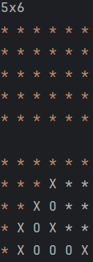
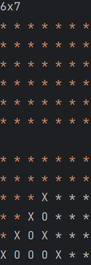

# ConnectFourGame
Connect 4 between 1 person VS robot. Player can choose a 6x7 or 5x6 grid to play on as well as the opponent difficulty.
 ***
Patterns Used...
* Observer Pattern, the game board will update the observers when the board changes or game ends
* Command, each move is encapsulated as a Command (execute to place, undo to undo that choice)
* State Pattern is how we keep track of the state of the game (setupState, playerTurnState, OpponentTurnState, gameOverState)
* Factory Method, a CharacterFactory that will set up each game instance (players, the board, initial game state)
* Strategy Pattern, check for win strategies (vertical, horizontal, diagonal)
***

Locations of patterns and their files...

* Observer Pattern based files are in the observers folder
* Command Pattern based files are in the command folder
* State Pattern is how we keep track of the state of the game (setupState, playerTurnState, OpponentTurnState, gameOverState)
* Factory Pattern is CharacterFactory inside of characters folder
* Strategy Pattern based files are in the strategy folder

***

Sample Game options (same game, different grid options)

